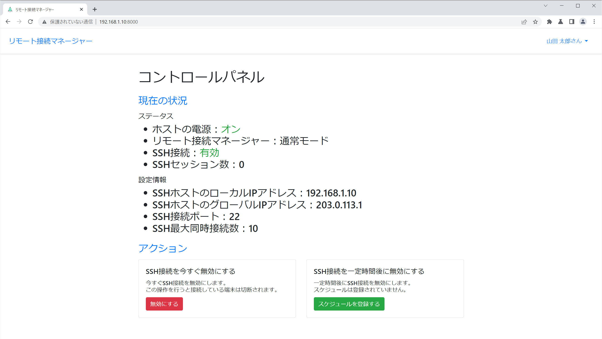

# リモート接続マネージャー
より安全、より便利にリモートホストにSSHで接続するためのウェブアプリ。



## アプリケーションの種類について
リモート接続マネージャーはPythonで実装されたWebアプリケーションフレームワークのDjangoで開発されたウェブアプリです。  
プログラムファイルをダウンロードして任意のサーバーで実行するだけで、インターネットやローカルネットワーク上で簡単にウェブ技術をベースにしたサービスを立ち上げることができます。
## このアプリケーションでできること
- リモートホストのシステムステータスを確認する
- リモートホストのSSHサービスのステータス・設定を確認する
- リモートホストのSSHサービスを起動・停止させる
- 指定した期間だけリモートホストのSSHサービスを実行する
## 使い始める
**動作環境：Linux OS（Debian系・Red Hat系に対応）、OpenSSHサーバーコンポーネント・Python 3.10以上がインストール済み**
1. 下のリンクから最新のプログラムをダウンロードしてそれを解凍してください。  
[https://github.com/bigbamboo-jp/remote-connection-manager-ja/releases](https://github.com/bigbamboo-jp/remote-connection-manager-ja/releases)
1. アプリケーションのルートディレクトリ（`superuser_module.py`があるディレクトリ）で以下のコマンドを実行してください。  
※`superuser_module.py`はアプリケーション上でroot権限が必要なコマンドを実行するためのモジュールです。
    ```
    sudo python3 superuser_module.py standby
    ```
1. アプリケーションのルートディレクトリで**手順2とは別のGNOME端末を使って**以下のコマンドを実行してください。
    ```
    python3 -m venv .venv
    source djangox/bin/activate
    ```
1. プロンプトの前に`(.venv)`が表示されていることを確認して、以下のコマンドを実行してください。
    ```
    (.venv) $ pip install -r requirements.txt
    (.venv) $ python3 manage.py migrate
    (.venv) $ python3 manage.py createsuperuser
    (.venv) $ python3 manage.py runserver
    # Starting development server at http://127.0.0.1:8000/
    ```
1. ウェブブラウザで [http://127.0.0.1:8000/](http://127.0.0.1:8000/) にアクセスするとアプリケーションを使用できます。
> ヒント：サイト名の変更などは管理サイト（[http://127.0.0.1:8000/admin/](http://127.0.0.1:8000/admin/)）で行うことができます。
## セキュリティ対策
このアプリケーションには実行するのにroot権限が必要な機能があり、それらの機能は拡張モジュール（`superuser_module.py`）と連携することによって実現されています。  
その仕組み上、拡張モジュール及び拡張モジュールがアクセスするファイルに適切なセキュリティ対策を施す必要があります。  
以下のファイルについては必ずファイル権限の設定を行ってください（rootユーザー以外は読み取り専用にすることを推奨）。
- `simplemmap.py`
- `superuser_module.py`
- `system_connector.py`
## 定期処理のスケジューリング
このアプリケーションには定期的に行わなければいけない処理を記述したシェルスクリプト（`routine_processing.sh`）が付属しています。  
システムによって定期処理が自動で行われるようにするには、プログラムファイルがあるディレクトリのパスを書き込んだシェルスクリプトをcronに登録してください。
## 他言語への対応について
現在、このプロジェクトはアプリケーション・ドキュメント共に日本語版のみ製作しています。  
今後、時間ができたときに他言語版も製作して公開する予定です。
## ライセンス
このアプリケーションを開発する際に使用したテンプレートであるDjangoX（[https://github.com/wsvincent/djangox](https://github.com/wsvincent/djangox)）のライセンスは[LICENSE](LICENSE)を参照してください。  
リモート接続マネージャー自体のライセンスは[REMOTE CONNECTION MANAGER LICENSE](REMOTE%20CONNECTION%20MANAGER%20LICENSE)を参照してください。